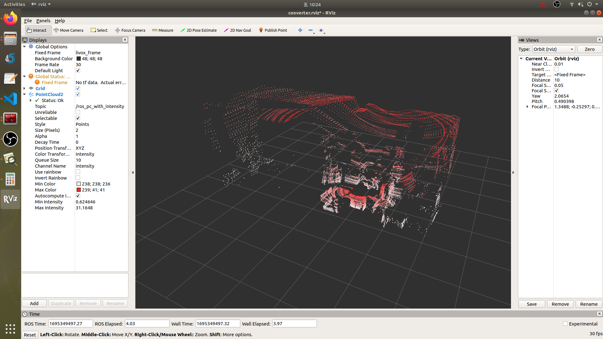

# mid360-utils

本代码为mid360使用的一些工具代码。

## mid360_viewer
这个工具用来可视化mid360的数据，解释mid360的扫描方式。

**官方的扫描方式动画：**  
可以看出，有4条line同时扫描，360°旋转，从上到下再到上往复，但每次扫描的起始位置为上一次结束位置，并不保证是最低/最高处。由于雷达的FoV可以人工指定，因此10Hz的1次扫描在不同FoV下**可能**（未测试）经过上下边界的次数不一样。  
同时，每条线旋转时并不是水平，而是螺旋式提升的。  
详细的分析可以查看代码和`/data/output.zip`中的数据分析。  
<div align="center">

</div>

**编译：**  
正常clone下来，编译即可。由于需要livox的自定义消息类型，所以与`livox_ros_driver2`放到同一个 working_space 下的src中较为方便。
或者自行修改`CustomMsg.h`的路径也行。

**运行：**  
```bash
roslaunch mid360_viewer viewer.launch
```

**代码功能说明：**  
代码能够接收两种数据类型，分别是ros下的sensor_msg的pointcloud2，以及livox的自定义消息类型。
在launch文件中修改`msg_type`的类型，如果是pointcloud2格式，则代码直接收发，过程中计算了角度并存到intensity字段；
如果是`custom_msg`的类型，则分开4条线束的id并分开publish出来，同时将自定义消息类型中的`offset_time`字段放到intensity，并计算了角度。

**测试数据：**  
`data/`下面有两段测试数据，msg_type0.bag和1.bag，分别为：livox自定义数据格式，和ros的pointCloud2格式，两个录制。  

**运行结果：**   
- 每次scan的点数大概是2w，一条line的数据量是5k左右。下图用红黄蓝绿四色编码4条line，可以看出空间中基本呈交替分布。  
<div align="center">

</div>

- 对于一条线，采用line0进行分析，将每个点的`offset_time`字段（表示当前点的扫描时刻相对于这次scan的起始时刻的时间，单位ns）放在intensity中，在rviz进行显示。白色：`offset_time`较大，即靠后的点，红色：较早的点。可以看出，可能正处于从上到下扫描（右图）、或从下到上（左图），且一个周期内可能出现扫描到头反向过程（右图扫描到最下端后往上扫描，在30°左右出现了红白交叉的线束）。  
<div align="center">


</div>

- 对每条线束的俯仰角排序输出，可以在`data/output.zip/livox_mid360_sortbyangle_xxx.txt`中查看。进一步分析，可以验证上述结论：_有4条line同时扫描，360°旋转，从上到下再到上往复，但每次扫描的起始位置为上一次结束位置，并不保证是最低/最高处。_
- 重复扫描模式与非重复扫描模式，上述结论没有显著性差异。

**总结：**  
Mid360的扫描模式不同于传统机械式扫描，因此对于基于LOAM系列的SLAM算法，需要有以下需要注意事项：  

- 去畸变时，传统机械式扫描采用当前点的偏角（偏航角）在360°的几分之几，然后对运动增量进行插值，对该点进行去即便。mid360可以直接利用`offset_time`这个时间计算时间和插值，处理起来较为方便；（可参考：Lio-livox的代码）

```cpp
// LidarFeatureExtractor.cpp 中的 FeatureExtract 函数：
  double timeSpan = ros::Time().fromNSec(msg->points.back().offset_time).toSec();
  ···
  point.normal_x = ros::Time().fromNSec(p.offset_time).toSec() /timeSpan;        // 将该点在这次运动的百分比放到normal_x字段；
// PoseEstimation.cpp 中的 RemoveLidarDistortion 函数：
  float s = cloud->points[i].normal_x;                                            // 获取百分比
  Eigen::Quaterniond delta_qlc = Eigen::Quaterniond::Identity().slerp(s, qlc).normalized();  // 进行旋转插值
```

- 特征提取时，传统机械式扫描有 `scan/ring/line` 表示线束信息，对于每一条线束依次提取几个点判断是否是角点/平面点。而mid360不具备线束信息，可以尝试通过计算角度后获取线束（但这些角度不是固定的，而是有轻微变化的，或许可以尝试每1.3°<官方说平均的角分辨率约为1.3°*1.3°>当作一个线束），但注意可能出现同一个角度有line0\~4中的多个line或上下往复扫描时的数据重叠，因此不能直接将原始的输出顺序直接遍历，应该对偏角0~360°进行排序后，再按序索引。
- 如果特征提取不是基于线束的搜索，而是基于近邻点查找的（例如Fast-LIO/Lio-livox等算法），则不需要改进。


## mid360_to_ring
该代码将mid360的CustomMsg格式转化为PointXYZI格式，其中`intensity`字段的整数部分为（近似的）线束`ring`，小数部分为该点扫描时刻相对于这次扫描开始时的偏移的比例（可直接用于去畸变）。

<div align="center">

</div>

**代码功能说明：**  
接收：livox的`CustomMsg`格式，发布ROS的`sensor_msg/PointCloud2`格式。  
代码计算了每个点的俯仰角，用于判断线束（近似的），同时将每个线束中的角度按顺序排序，避免了mid360一帧扫描时多个line/多次往复时，扫过同一个线束而造成点的顺序不正确，以便于基于线束搜索的特征提取SLAM算法。  
但需要注意的是，完整的点顺序并不是按照线束递增的，但具体的对于每个线束内角度是连续的。在使用时只需要根据线束分开处理即可。  

默认的FOV是-7.x~53.x°，模拟输出32线。如果在上位机调整了mid360的FOV，或不同线束，请直接修改代码中的变量。

